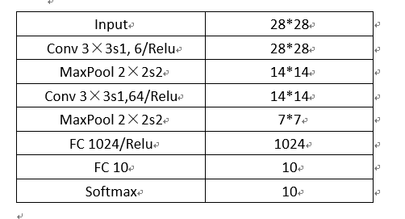
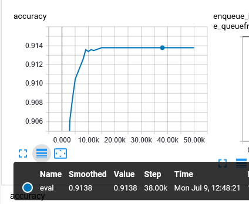
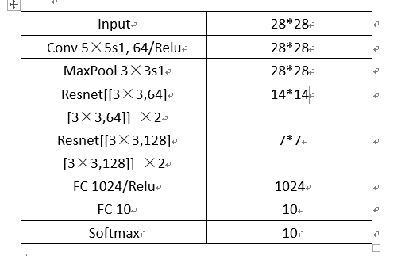
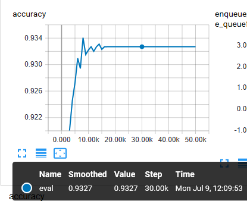

使用两种模型在fashion-mnist数据集上进行训练，因为图像是28*28大小，数据量不大，所以不使用深层的卷积网络，使用的两种模型一种是2 Conv Layers+ 2 Dense layer，另一种是只有2个残差单元，总共13层的Resnet13.

## 2 Conv Layers+ 2 Dense layer
网络层详细如下图

	

优化器使用Adam，迭代50000次，batch size=100，学习速率采用的是指数衰减函数，其具体设置为：

	learning_rate = tf.train.exponential_decay(0.001,tf.train.get_global_step(),100,0.95,staircase=True)

用以下命令启动训练，每迭代1000次保存一下模型，并且会对整个测试集进行一次预测，输出预测的精度

	python train_net.py --net cnnnet

其结果如下图：

	

最后精度达到0.9138

## Resnet13

	

Resenet13模型的具体训练方式与上面模型一直，启动Resnet13运行的命令为

	python train_net.py --net resnet_v2

其结果:

	

最后精度达到了0.9327
	

